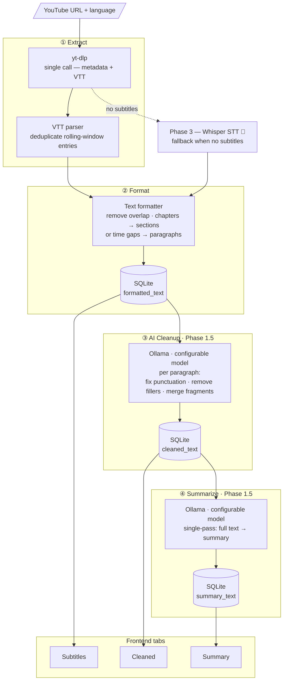

# YT Summarizer

Turn YouTube videos into scannable text so you can decide what to watch, save, or skip.

## Watch or Skip

Video is expensive to evaluate:

- A 10-minute video can take 10 minutes just to judge.
- Titles and thumbnails rarely show the real substance.
- Intros, delivery, pacing, filler, and repetition add cognitive load.

YT Summarizer gives you a short AI summary of any YouTube video, so you can:

- understand the core idea quickly;
- decide whether the full video deserves your attention;
- skip low-value content without spending time on it.

The goal: turn a watch-or-skip guess into a fast, informed decision.

→ **[Quick Start Guide](docs/quick-start-guide.md)**

---

If you care about reducing cognitive load and saving time in the age of information overload, you might also find this useful:  
**[llm-onpage-summarizer](https://github.com/ioncat/llm-onpage-summarizer)** — summarize any web page with a local LLM, right in your browser.

---

## Pipeline

Each processed layer is stored separately in SQLite and shown as a dedicated tab in the UI.



**Language**: defaults to "Auto (detect)" — the original video language is detected automatically from yt-dlp metadata. Manual override available in the dropdown. If the selected language has no subtitles, the UI shows available languages with one-click retry.

**Chapter-aware formatting**: if the video creator defined chapters, subtitle text is grouped by chapter boundaries and each chapter becomes a `##` heading in the output — preserving the author's original structure. Falls back to time-gap paragraph splitting when no chapters are present.

**AI cleanup**: runs locally via Ollama — no data leaves the machine. If Ollama is offline, "Cleaned" tab is greyed-out with a tooltip.

**Completion notifications**: when cleanup or summarization finishes while you're on another tab, the tab title changes to "✓ Done" and a browser notification fires (if permission granted).

---

## How It Works

### AI Cleanup

The formatted subtitle text is sent to a local Ollama model **paragraph by paragraph**. Each paragraph is independently cleaned — punctuation fixed, filler words removed, sentence fragments merged. If Ollama is unavailable or the request fails, the original paragraph is kept as-is. Progress is shown live in the UI: `Cleaning: 1:23 · paragraph 12 / 87`.

### AI Summarization

Two modes, selected automatically based on text length:

**Single-pass** (texts under ~24 000 chars): the full text is sent to the model in one request. Fast, works well for short videos.

**Map-Reduce** (longer texts): the text is split into overlapping ~3 000-char chunks. Each chunk is summarized independently (MAP step), then all chunk summaries are combined into a final structured document (REDUCE step). Progress is shown live: `Summarizing: 4:12 · chunk 18 / 28`.

### What the model actually receives

The prompt sent to Ollama is assembled from several sources — not just what you see in Settings:

```
[Language instruction]  ← injected automatically from video metadata
[User prompt template]  ← from Settings (editable)
[Input text]            ← from database (cleaned_text or formatted_text)
```

**Language instruction** is added automatically based on the video's detected language — e.g. `Respond in Russian.` This ensures the model replies in the correct language even if it tends to default to English. It is not shown in Settings because it's data-driven: the same prompt template works for any language.

**System prompt** (also from Settings) is sent as a separate system message alongside the user message.

You can customize both system and user prompts per stage in **Settings → AI Cleanup / Summarization**.

---

## Architecture

```
yt-summarizer/
├── app/
│   ├── backend/             # FastAPI + Python
│   │   ├── main.py          # App entry point, DB init
│   │   ├── config.py        # Settings (pydantic-settings)
│   │   ├── models/          # SQLAlchemy ORM + async engine
│   │   ├── routers/api.py   # REST endpoints
│   │   └── services/
│   │       ├── subtitle_extractor.py   # yt-dlp wrapper
│   │       ├── text_formatter.py       # VTT → clean text
│   │       ├── text_cleaner.py         # Ollama LLM cleanup
│   │       ├── text_summarizer.py      # Ollama LLM summarization
│   │       └── video_service.py        # DB CRUD
│   ├── frontend/            # React + TypeScript + Vite
│   │   └── src/
│   │       ├── api.ts       # Typed fetch wrappers
│   │       └── pages/       # Home, Processing, Result, History, Settings
│   └── data/
│       ├── db/              # SQLite database (gitignored)
│       └── www.youtube.com_cookies.txt  # YouTube cookies (gitignored)
├── docs/
│   ├── backlog/             # Epics and user stories
│   ├── requirements.md      # Functional requirements
│   └── phase2-architecture.md  # LLM summarization design
├── Makefile
├── docker-compose.yml
└── README.md
```

### API

| Method | Endpoint | Description |
|--------|----------|-------------|
| POST | `/api/process` | Submit URL + language |
| GET | `/api/status/{task_id}` | Poll processing status |
| GET | `/api/result/{video_id}` | Get subtitle text + metadata |
| POST | `/api/result/{video_id}/cleanup` | Trigger AI cleanup |
| DELETE | `/api/result/{video_id}/cleanup` | Cancel running cleanup |
| POST | `/api/result/{video_id}/summary` | Trigger AI summarization |
| DELETE | `/api/result/{video_id}/summary` | Cancel running summarization |
| GET | `/api/health` | Backend + Ollama status |
| GET | `/api/history` | Paginated processing history |
| DELETE | `/api/result/{video_id}` | Delete video and all its data |
| GET | `/api/settings` | All settings (app + pipeline stages) |
| PUT | `/api/settings/app` | Save app settings (Ollama URL, paths) |
| PUT | `/api/settings/{stage}` | Save pipeline settings (model, prompts) |
| DELETE | `/api/settings/{stage}` | Reset stage to defaults |
| GET | `/api/models` | Available Ollama models |
| POST | `/api/settings/upload-cookies` | Upload YouTube cookies file |

---

## Roadmap

| Phase | Status | Description |
|-------|--------|-------------|
| Phase 1 — Subtitle Extraction | ✅ Done | Extract, format, store, display subtitles |
| Phase 1.5 — LLM Cleanup & Summarization | ✅ Done | Cleanup, summarization, Settings UI, auto-pipeline, cancel, auto language detection, chapter-aware formatting, completion notifications |
| Phase 2 — Summarization Quality | 🔄 In Progress | Map-Reduce implemented; prompt tuning and hierarchical reduce ongoing |
| Phase 3 — Speech-to-Text | 🔵 Planned | Whisper fallback when subtitles unavailable |

See [backlog/BACKLOG.md](backlog/BACKLOG.md) for detailed epic breakdown.
