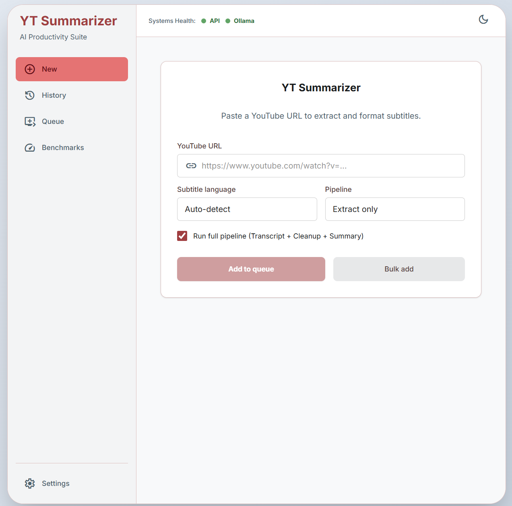
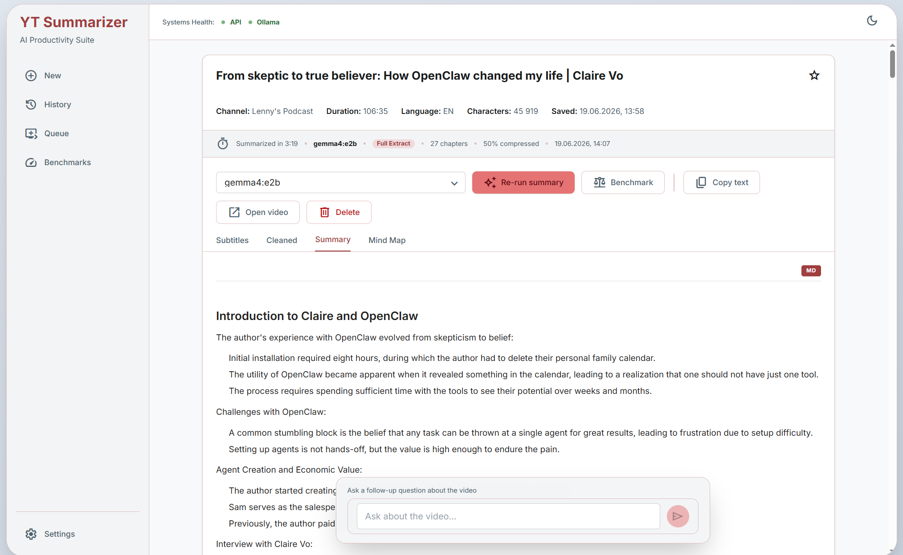
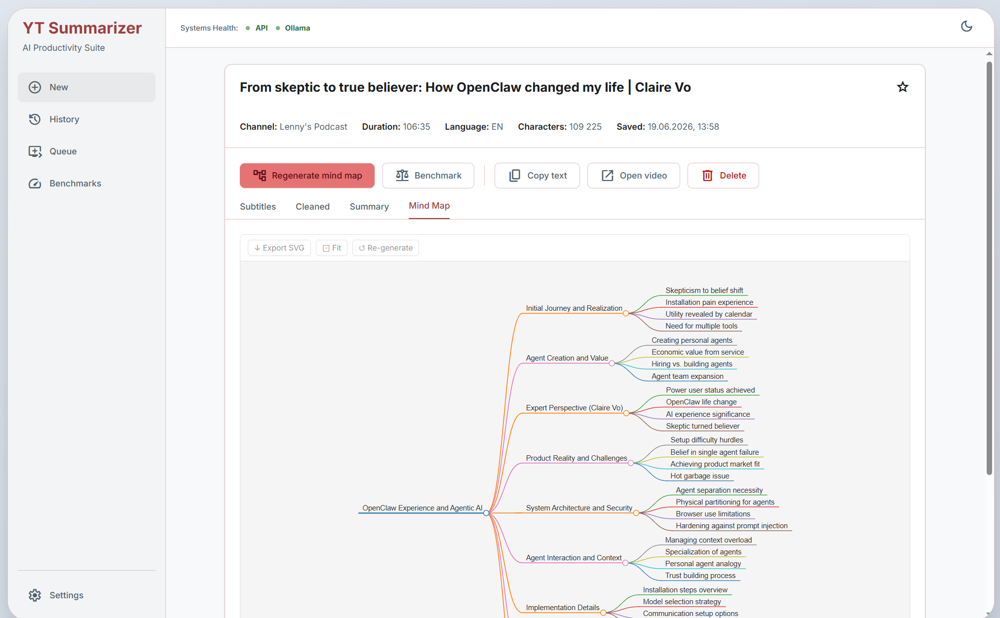

# YT Summarizer

AI tool for YouTube: extract, clean, summarize video content — and chat with the content.

## Watch or Skip

Video is expensive to evaluate:

- A 10-minute video can take 10 minutes just to judge.
- Titles and thumbnails rarely show the real substance.
- Intros, delivery, pacing, filler, and repetition add cognitive load.

YT Summarizer gives you a short AI summary of any YouTube video, so you can:

- understand the core idea quickly;
- decide whether the full video deserves your attention;
- skip low-value content without spending time on it.

The goal: turn a watch-or-skip guess into a fast, informed decision.

→ **[Quick Start Guide](docs/guides/quick-start-guide.md)** — minimal setup to try it out  
→ **[User Guide](docs/guides/USER_GUIDE.md)** — features, settings, troubleshooting, FAQ  
→ **[System Behavior](docs/engineering/system-behavior.md)** — pipeline activity diagram + state diagrams (Mermaid)







---

If you care about reducing cognitive load and saving time in the age of information overload, you might also find this useful:  
**[llm-onpage-summarizer](https://github.com/ioncat/llm-onpage-summarizer)** — summarize any web page with a local LLM, right in your browser.

---

## Pipeline

```
YouTube URL → Extract → Format → AI Cleanup → Summarize → Chat Q&A
                  ↓         ↓          ↓            ↓
              metadata    paragraphs  cleaned    summary
              + VTT       + chapters  text       (Single / Map-Reduce / Full Extract)
```

Each stage's output is stored separately in SQLite and shown as its own tab: **Subtitles · Cleaned · Summary · Mind Map · Chat**.

**Key features:**
- **AI via Ollama** — connect any local or remote LLM
- **Auto language detection** — picks original video language from yt-dlp metadata
- **Chapter-aware formatting** — preserves YouTube creator's chapter structure
- **Multiple processing modes** — Single-pass / Map-Reduce / Full Extract, auto-selected by text length and structure
- **Processing queue** — bulk URL submission, durable background processing, auto-resume on restart
- **Mind map** — generate structured mind map from summary via LLM
- **Benchmark page** — compare 2–4 models side by side on same content
- **Chat Q&A** — ask follow-up questions with full video context
- **Completion notifications** — tab title + browser notification when pipeline finishes

See the [User Guide](docs/guides/USER_GUIDE.md) for details on each feature.

---

## Where This Is Going

Current pipeline works well for most videos. The longer-term direction is a local **document compiler**: instead of summarizing text, extract a structured Intermediate Representation — claims, entities, quotes, terminology — then render any output mode from it: TL;DR, summary, full reference, study guide.

One processing pass. Any output format. Nothing invented.

This is active research. The current Map-Reduce and Full Extract modes are the first steps toward it.

---

## Tech Stack

| Component | Technology |
|---|---|
| Frontend | React + TypeScript + Vite |
| Backend | Python + FastAPI |
| LLM | Ollama |
| Subtitle extraction | yt-dlp |
| Database | SQLite (async via aiosqlite) |

---

## API

| Method | Endpoint | Description |
|--------|----------|-------------|
| POST | `/api/process` | Submit URL + language |
| GET | `/api/status/{task_id}` | Poll processing status |
| GET | `/api/result/{video_id}` | Get all data for a video |
| POST | `/api/result/{video_id}/cleanup` | Trigger AI cleanup |
| DELETE | `/api/result/{video_id}/cleanup` | Cancel cleanup |
| POST | `/api/result/{video_id}/summary` | Trigger AI summarization |
| DELETE | `/api/result/{video_id}/summary` | Cancel summarization |
| POST | `/api/result/{video_id}/mindmap` | Generate mind map |
| POST | `/api/queue/bulk` | Add URLs to processing queue |
| GET | `/api/queue` | Queue items with live progress |
| DELETE | `/api/queue/{id}` | Remove pending item |
| POST | `/api/benchmark/run` | Run N-model benchmark |
| GET | `/api/history` | Paginated history |
| GET | `/api/settings` | All settings |
| PUT | `/api/settings/app` | Save app settings |
| GET | `/api/models` | Available Ollama models |
| GET | `/api/health` | Backend + Ollama status |

Full API reference in [CLAUDE.md](CLAUDE.md).

---

## Roadmap

| Phase | Status | Description |
|-------|--------|-------------|
| Phase 1 — Subtitle Extraction | ✅ Done | Extract, format, store, display |
| Phase 1.5 — LLM Cleanup & UX | ✅ Done | Cleanup, summarization, Settings, auto-pipeline, cancel, chapter-aware, queue, notifications |
| Phase 2 — Summarization Quality | 🔄 In Progress | Map-Reduce ✅, Full Extract ✅, Benchmark ✅, Mind Map ✅ — XL hierarchical mode 🔵 |
| Phase 3 — Speech-to-Text | 🔵 Planned | Whisper fallback when no subtitles |

See [docs/delivery/backlog/BACKLOG.md](docs/delivery/backlog/BACKLOG.md) for detailed epic breakdown.
