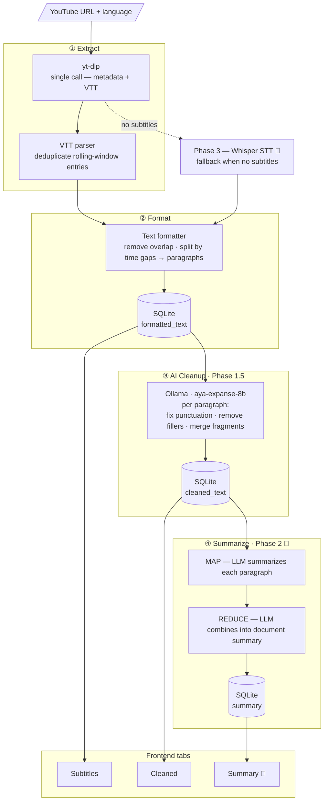

# YT Summarizer

Extract, format, and store YouTube video subtitles for quick content review. Paste a URL, pick a language — get clean, readable text without watching the video. Optionally clean up the transcript with a local LLM (Ollama) to fix punctuation and remove filler words.

---

## Quick Start (Docker)

> Requires: Docker, Docker Compose, YouTube cookies file

```bash
# 1. Clone the repo
git clone <repo-url>
cd yt-summarizer

# 2. Export YouTube cookies
#    Install "Get cookies.txt LOCALLY" in Chrome, open youtube.com, export.
#    Save the file as:
cp /path/to/exported-cookies.txt data/www.youtube.com_cookies.txt

# 3. Copy env config
cp .env.example .env

# 4. Build and start
docker compose up --build

# App is available at:
#   Frontend  → http://localhost:3000
#   API       → http://localhost:8000
```

To stop:
```bash
docker compose down
```

---

## Quick Start (Local Dev)

### Requirements

- Python 3.12+
- Node.js 18+ (required by yt-dlp for YouTube bot detection bypass)
- yt-dlp (`pip install yt-dlp` or system package)
- [Ollama](https://ollama.com) with `cas/aya-expanse-8b` *(optional — for AI text cleanup)*

### One-click launch

```bash
# Set up env once
cp .env.example .env
```

**Windows** — double-click `start.vbs`.
Opens Windows Terminal with two split panes (backend + frontend) and launches the browser automatically.

**Linux / macOS**:
```bash
chmod +x start.sh && ./start.sh
# Ctrl+C stops both services
```

### Manual launch (two terminals)

```bash
# Terminal 1 — Backend
cd backend
pip install -r requirements.txt
uvicorn main:app --reload --port 8000

# Terminal 2 — Frontend
cd frontend
npm install
npm run dev
# → http://localhost:3000
```

---

## Configuration (`.env`)

```env
# Path to SQLite database (created automatically)
DATABASE_PATH=../data/db/yt_summarizer.sqlite

# Path to YouTube cookies file (Netscape format)
# Required to bypass YouTube bot detection
COOKIES_PATH=../data/www.youtube.com_cookies.txt

# Debug mode (enables SQLAlchemy query logging)
DEBUG=false

# Ollama — local LLM for text cleanup (optional)
# Install Ollama, then: ollama pull cas/aya-expanse-8b
OLLAMA_URL=http://localhost:11434
OLLAMA_MODEL=cas/aya-expanse-8b
```

### Ollama setup (AI text cleanup)

Text cleanup runs locally via [Ollama](https://ollama.com) — no API keys, no data leaves the machine.

**1. Install Ollama**
Download and run the installer from [ollama.com](https://ollama.com/download).

**2. Pull a model of your choice**
```bash
ollama pull <model-name>
```

Browse available models at [ollama.com/library](https://ollama.com/library). Any instruction-following model works; multilingual models perform better on non-English transcripts.

**3. Set the model name in the configuration** — see the [Configuration](#configuration-env) section.

**If Ollama is not running** — the pipeline completes normally, the "Cleaned" tab is shown as greyed-out with a tooltip explaining why.

---

### Cookies setup

YouTube blocks yt-dlp without valid cookies. To export:
1. Install **"Get cookies.txt LOCALLY"** extension in Chrome
2. Open [youtube.com](https://www.youtube.com) and log in
3. Click the extension → Export cookies → Save as `data/www.youtube.com_cookies.txt`

Re-export if you start getting 429 or "sign in required" errors.

---

## Pipeline

Each processed layer is stored separately in SQLite and shown as a dedicated tab in the UI.



**Language**: if the requested language has no subtitles, the UI shows available languages with one-click retry. The language parameter carries forward to Phase 3 (Whisper) — no extra input needed.

**AI cleanup**: runs locally via Ollama — no data leaves the machine. If Ollama is offline, "Cleaned" tab is greyed-out with a tooltip.

---

## Architecture

```
yt-summarizer/
├── backend/                 # FastAPI + Python
│   ├── main.py              # App entry point, DB init
│   ├── config.py            # Settings (pydantic-settings)
│   ├── models/              # SQLAlchemy ORM + async engine
│   ├── routers/api.py       # REST endpoints
│   └── services/
│       ├── subtitle_extractor.py   # yt-dlp wrapper
│       ├── text_formatter.py       # VTT → clean markdown
│       ├── text_cleaner.py         # Ollama LLM cleanup (paragraph-by-paragraph)
│       └── video_service.py        # DB CRUD
├── frontend/                # React + TypeScript + Vite
│   └── src/
│       ├── api.ts           # Typed fetch wrappers
│       └── pages/           # Home, Processing, Result, History
├── data/
│   ├── db/                  # SQLite database
│   └── www.youtube.com_cookies.txt  # YouTube cookies (gitignored)
└── docs/
    ├── requirements.md      # Functional requirements
    └── phase2-architecture.md  # LLM summarization design
```

### API

| Method | Endpoint | Description |
|--------|----------|-------------|
| POST | `/api/process` | Submit URL + language + `enable_cleanup` flag |
| GET | `/api/status/{task_id}` | Poll processing status |
| GET | `/api/result/{video_id}` | Get formatted subtitle text |
| GET | `/api/history` | Paginated processing history |
| DELETE | `/api/result/{video_id}` | Delete video and all its data |

---

## Roadmap

| Phase | Status | Description |
|-------|--------|-------------|
| Phase 1 — Subtitle Extraction | ✅ Done | Extract, format, store, display subtitles |
| Phase 1.5 — LLM Text Cleanup | ✅ Done | Local Ollama cleans up auto-generated transcripts |
| Phase 2 — LLM Summarization | 🔵 Planned | Map-reduce summarization (paragraph → document summary) |
| Phase 3 — Speech-to-Text | 🔵 Planned | Whisper fallback when subtitles unavailable |

See [backlog/BACKLOG.md](backlog/BACKLOG.md) for detailed epic breakdown.
