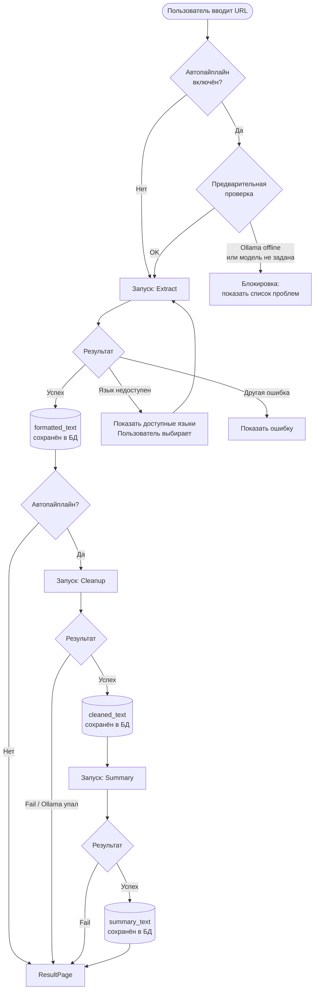
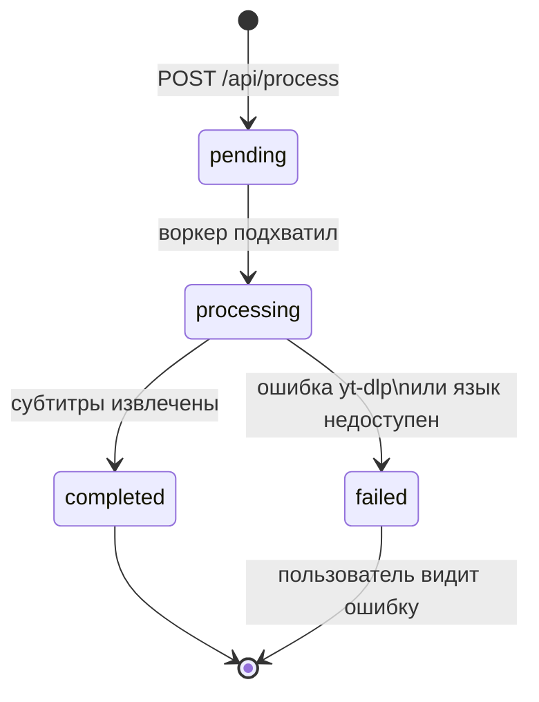
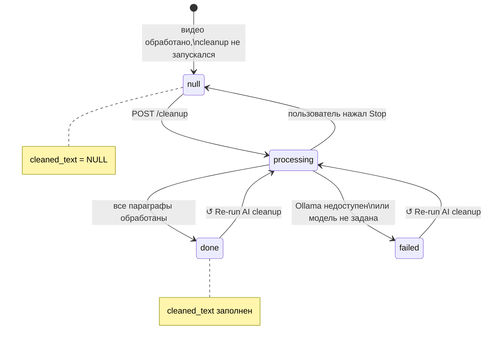
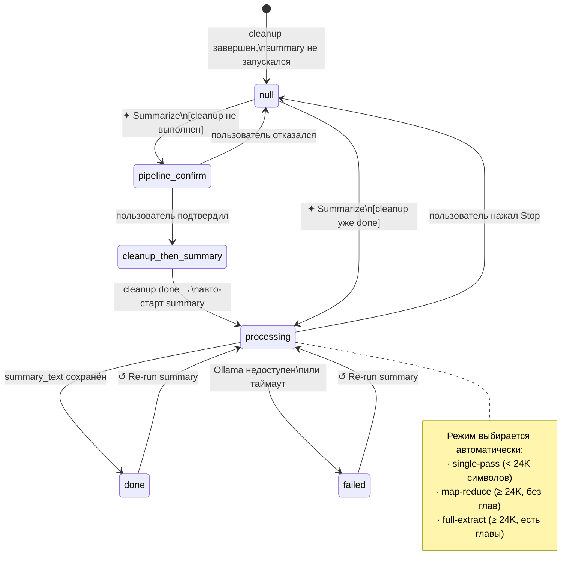
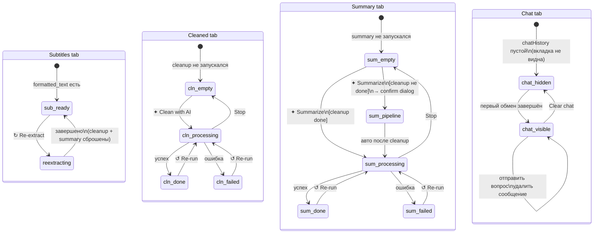
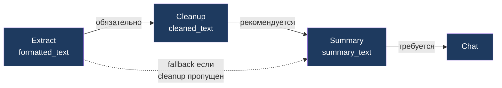

# Поведенческая модель — YT Summarizer

Документ описывает **как работает система**: пайплайн обработки, жизненный цикл сущностей и логику интерфейса. Для понимания **из чего состоит система** — см. `CLAUDE.md`.

---

## 1. Пайплайн обработки (Activity Diagram)

Общий поток: от ввода URL до итогового результата.

---

## 2. Жизненный цикл задачи извлечения (Task)

Фоновая задача, создаётся при сабмите URL.

---

## 3. Жизненный цикл AI Cleanup

Статус хранится в колонке `cleanup_status` таблицы `subtitles_formatted`.

---

## 4. Жизненный цикл Summary

Статус хранится в колонке `summary_status`. Summary использует `cleaned_text` если доступен, иначе запрашивает запуск пайплайна.

---

## 5. Состояния интерфейса ResultPage

Какие действия доступны пользователю в зависимости от состояния данных.

---

## 6. Взаимозависимости этапов

Жирная стрелка — рекомендуемый путь. Пунктир — возможный, но предупреждает пользователя через диалог подтверждения.
