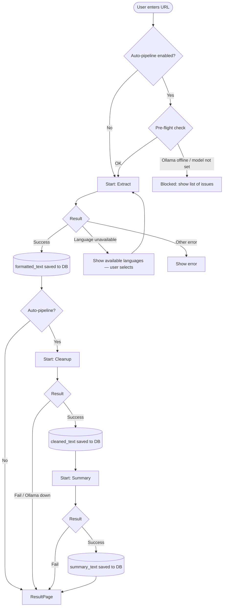
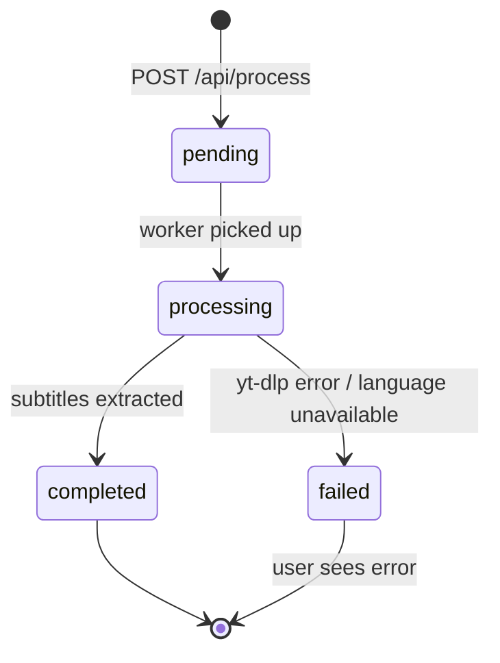
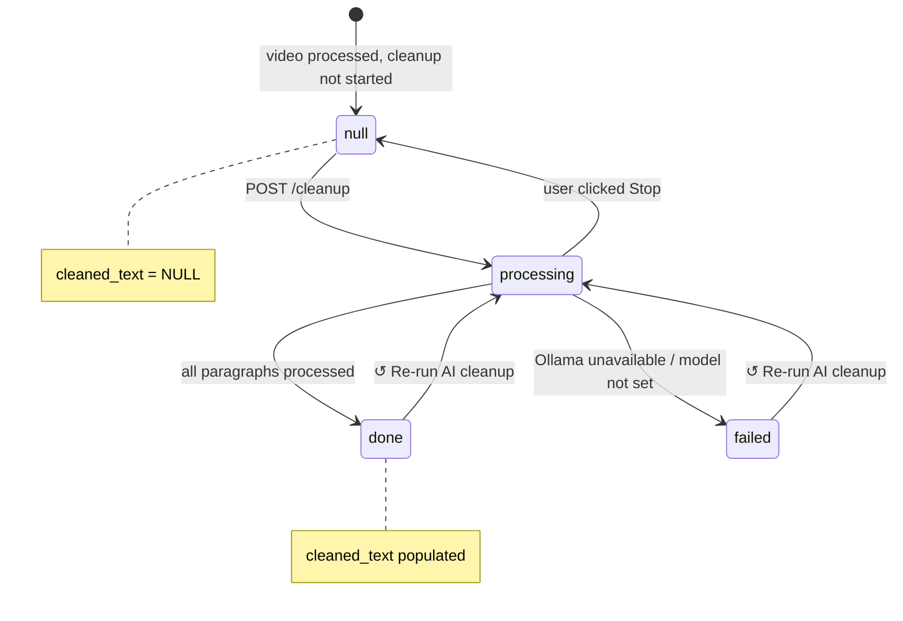
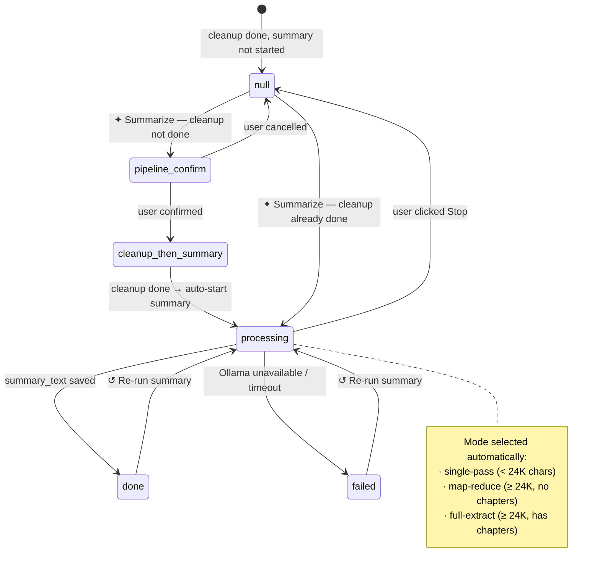
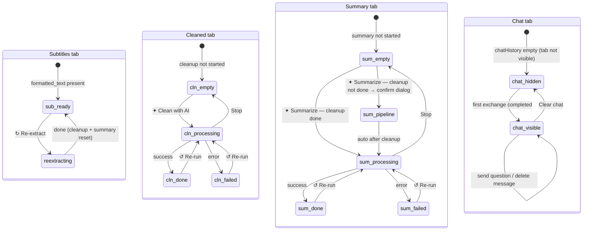
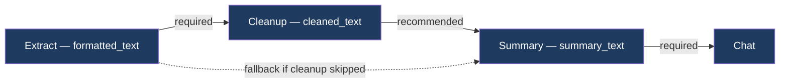

# System Behavior — YT Summarizer

Describes **how the system works**: processing pipeline, entity lifecycles, and UI logic. For **what the system is made of** — see `CLAUDE.md`.

---

## 1. Processing Pipeline (Activity Diagram)

Overall flow: from URL input to final result.

---

## 2. Extraction Task Lifecycle

Background task, created on URL submit.

---

## 3. AI Cleanup Lifecycle

Status stored in `cleanup_status` column of `subtitles_formatted`.

---

## 4. Summary Lifecycle

Status stored in `summary_status`. Summary uses `cleaned_text` if available, otherwise prompts to run the pipeline.

---

## 5. ResultPage UI States

Actions available to the user depending on data state.

---

## 6. Stage Dependencies

Solid arrow — recommended path. Dashed — possible, but shows a confirmation dialog to the user.
